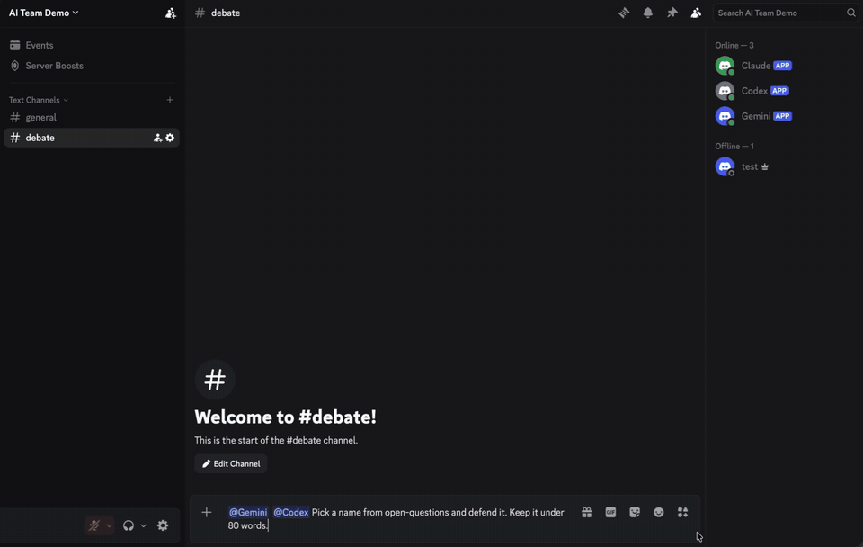
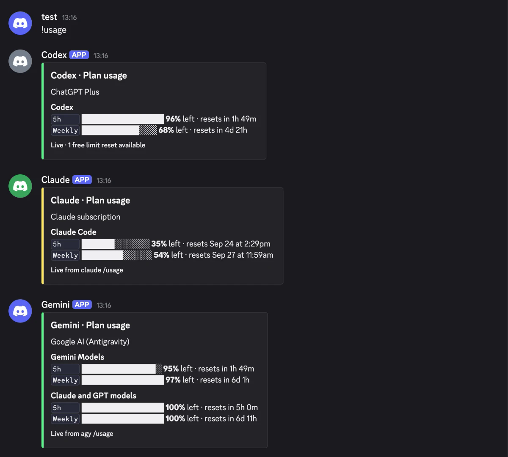
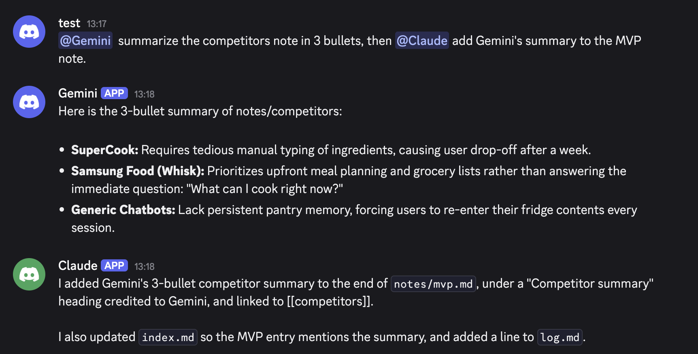
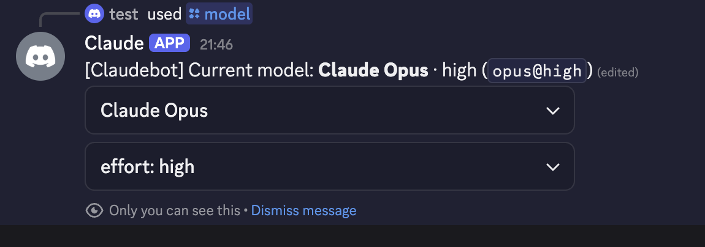

# Discord AI Team: Claude, ChatGPT and Gemini in your Discord, with no API keys

**English** · [한국어](README.ko.md)

You already pay for Claude, ChatGPT, or Gemini. This project turns those subscriptions into a team of AI agents in your own Discord server. You can talk to them from your phone, and they can read each other's messages and even argue with each other.

- **No API keys, no per-token bills.** Each agent is the vendor's **official CLI, signed in with your own account (OAuth)**. Everything runs inside the plan you already have.
- **Any mix of agents.** One bot per settings file: three different AIs, or two Claudes (a "Writer" and a "Critic"), or just one.
- **You set the rules.** Names, roles, who may use each bot, what it may touch (read-only / edit / full), and where they may debate.

| `PROVIDER` | AI | CLI it runs | Subscription |
|---|---|---|---|
| `claude` | Claude | Claude Code (`claude -p`) | Claude Pro / Max |
| `codex` | ChatGPT | Codex CLI (`codex exec`) | ChatGPT Plus / Pro |
| `gemini` | Gemini | Antigravity CLI (`agy -p`) | Google AI plan |

<p align="center">
  
</p>

| `!usage`: live quota from all three plans | Handoff: Gemini summarizes, Claude writes it to the notes |
|---|---|
|  |  |



## What you can do

- **Ask from anywhere.** @mention a bot in a channel, or DM it. It works on the files in a folder you choose (a project, a notes vault, anything).
- **Send images.** Attach a photo with a bot mention in a channel, or send one in a DM. PNG, JPEG, GIF, and WebP are supported, up to four images per message and 20 MB each.
- **Send documents.** Attach PDF, TXT, DOCX, Markdown (`.md`, `.markdown`), or CSV files and the bot reads their text. Up to four documents per message and 10 MB each are supported. Long files are limited to 25,000 characters each and 60,000 characters total; PDFs are limited to the first 30 pages. Scanned PDFs need OCR, which is not supported.
- **Hand work between AIs.** `@gemini summarize the notes, then @claude add that summary to the plan`. The bot mentioned later waits for the earlier one's reply and builds on it. A mentioned bot also reads the channel messages since its last reply, including other bots' messages.
- **Let them debate.** Add two running bots to a channel's permissions and they can @mention each other there without copying a channel ID. They **stop after 4 turns** (configurable), and `!stop` ends it at once.
- **See your quota.** `!usage` posts a card with your remaining 5-hour and weekly limits. It is read live from each CLI and costs nothing.
- **Switch models on the fly.** `!model` opens a dropdown for model and reasoning effort, saved per channel.
- **Memory per channel.** Each channel is its own ongoing conversation and survives restarts. `!new` starts over; `!resume` lets you pick an older Discord conversation with that bot and continue it.
- **Forward text messages.** Forward a text message to a bot, and it reads it.

## How it works

```
                ┌─► bots/claude.env ─► claude -p   ─ your Claude login  ─┐
Discord server ─┼─► bots/codex.env  ─► codex exec  ─ your ChatGPT login ─┼─► WORKSPACE_DIR
                └─► bots/gemini.env ─► agy -p      ─ your Google login  ─┘
```

Every bot runs the same small Node.js program (`src/bot.js` + `src/runner.js`). Each Discord message becomes one CLI call that resumes that channel's conversation. `src/providers/` has one file per AI. Image attachments are briefly saved in `state/attachments/` for the CLIs and deleted after the reply. Document text is extracted in memory and included in the request. Running bots register themselves in `state/agents.json`, which is how they find each other for debates.

## Requirements

- macOS or Linux with Node.js 20.16–20.x or 22.3+ (`ctl.sh` needs zsh, which macOS has by default)
- The CLI for each AI you want, installed and signed in (step 1)
- A Discord server you own (a free private server is fine)

## Setup

### 1. Sign in to each CLI (one time)

```bash
claude             # type /login if it asks
codex login        # choose "Sign in with ChatGPT"
agy                # first run asks you to sign in with Google, then exit
```

The CLIs keep their own login. This project never touches passwords or API keys.

### 2. Create a Discord bot for each agent

At <https://discord.com/developers/applications>, once per bot:

1. **New Application** → name it (this is the name people see in Discord). Discord rejects brand names on their own, like "Claude", "Codex", or "Gemini", so add a word: "Claude Bot".
2. **Bot** tab → **Reset Token** → copy the token.
3. Same tab: turn on **Message Content Intent** (otherwise the bot sees empty messages).
4. **OAuth2 → URL Generator** → scope `bot` → permissions *View Channels, Send Messages, Read Message History, Embed Links, Add Reactions* → open the URL and add the bot to your server.

### 3. Set up channels

For automatic debates, add each bot (or a dedicated bot role) to the channel's permission settings with **View Channel**, **Send Messages**, and **Read Message History**. You do not need to copy its ID. If you set `ALLOWED_USER_IDS`, turn on **User Settings → Advanced → Developer Mode** and right-click yourself → **Copy User ID**.

Each channel keeps its own conversation, so make channels per **topic**, not per bot. For example:

| Channel | For | Bots debate? |
|---|---|---|
| `#general` | Everyday questions | off |
| `#project-x` | One project; context stays separate | off |
| `#debate` | Throw a question in, let them argue | **on when both bots are added** |

**Just want to try it?** Copy the included example out of this folder (`cp -r example-workspace ~/leftover-demo`) and point `WORKSPACE_DIR` at the copy. Don't point bots at a folder inside this repo, since your tokens live here. The example is a made-up side project ("Leftover", a fridge-to-dinner app) with notes and shared rules. Ask the bots to debate its open questions.

### 4. Install

```bash
git clone https://github.com/angdulu/discord-ai-team
cd discord-ai-team
npm install
```

### 5. Create one settings file per bot

Copy an example and name the copy whatever you like. **The file name is the bot's name in `ctl.sh`.**

```bash
cp bots/claude.env.example bots/claude.env
cp bots/codex.env.example  bots/codex.env
cp bots/gemini.env.example bots/gemini.env
chmod 600 bots/*.env
```

Then fill each one in. Every option is explained inside the file:

```ini
PROVIDER=claude                     # claude | codex | gemini
BOT_NAME=                           # shown in replies; default Claude / Codex / Gemini
ROLE=writer                         # optional; other bots see it in debates
DISCORD_BOT_TOKEN=<token>
WORKSPACE_DIR=/path/to/your/folder
PERMISSIONS=read-only               # read-only | edit | full
ALLOWED_CHANNEL_IDS=                  # empty = every channel the bot can access
ALLOWED_USER_IDS=<your user id>     # who may use it; empty = anyone in those channels
DEBATE_CHANNEL_IDS=                   # optional extra channel IDs
OWNER_NAME=<your name>
```

Want two Claudes? Make `bots/writer.env` and `bots/critic.env`, both with `PROVIDER=claude`, each with its own Discord bot token.

### 6. Choose permissions

| `PERMISSIONS` | The bot can | Claude | Codex | Gemini |
|---|---|---|---|---|
| `read-only` (default) | read files in `WORKSPACE_DIR` | reading allowed; editing tools blocked | OS sandbox blocks all writes | every tool denied unless allowlisted¹ |
| `edit` | read + create/edit files in `WORKSPACE_DIR` | `acceptEdits` | `workspace-write` sandbox | `--mode accept-edits`¹ |
| `full` | anything: any command, any path | skip all permission checks | no sandbox | skip all permission checks |

¹ Gemini also checks file reads against `~/.gemini/antigravity-cli/settings.json`. To let it read vault images and Discord attachments, add these two rules to `permissions.allow`, replacing the placeholders with absolute paths:
`"read_file(/absolute/path/to/WORKSPACE_DIR)"`, `"read_file(/absolute/path/to/discord-ai-team/state/attachments)"`.

Rules of thumb:
- **Set `ALLOWED_USER_IDS`** whenever you use `edit` or `full`. Anyone who can use the bot gets its permissions.
- **Only you in the server:** `edit` is a comfortable default.
- **`full`:** only for a folder or machine you'd be fine losing. Nobody approves each step.
- When something is denied, the reply ends with `⛔ Permission denied: …`. Trust that line over the bot's own claim that it "did" something.

### 7. Start

```bash
./ctl.sh start all        # or: ./ctl.sh start claude
./ctl.sh status all
./ctl.sh restart codex    # after editing its .env
./ctl.sh stop all
```

Look for `logged in as ...`. Logs are in `logs/<name>.log`.

## Recommended: point every bot at one shared memory folder

Each bot's channel memory is separate. But if every bot's `WORKSPACE_DIR` is the **same notes folder** (an Obsidian vault, an "LLM wiki", a plain folder of Markdown), they all read the same long-term memory. Something Claude saved on Monday is there for Gemini on Friday, in any channel.

- **One rulebook for all.** Each CLI reads its own instruction file from the folder: Claude reads `CLAUDE.md`, Codex reads `AGENTS.md`, and Gemini reads `GEMINI.md` (or `AGENTS.md`). Put the same rules in each, for example "keep an `index.md`, one note per topic, log changes in `log.md`", and every agent maintains the memory the same way.
- **Decide who writes.** The memory only grows if some bot can write. A good split is one writer on `PERMISSIONS=edit` with the others on `read-only`, so nothing gets overwritten by two agents at once.
- **Ask it to remember.** `@claude save what we decided about X to the notes`, then later, anywhere: `@gemini what did we decide about X?`

## Commands

| Type | Where | Does |
|---|---|---|
| `@bot …` | allowed channels (or a DM, no mention needed) | Ask that bot |
| `!new` | with a mention, or in DM | Start a fresh conversation in this channel |
| `!resume` | with a mention, or in DM | Pick a previous Discord conversation with this bot and continue it here |
| `!model` | with a mention | Pick model + reasoning effort |
| `!usage` | plain | Every bot posts its quota card (`@bot !usage` for just one) |
| `!stop` | plain | Stop running work in this channel and drop queued requests |

`!resume` lists conversations verified as Discord bot sessions plus conversations currently assigned to this bot. Choosing one from another channel detaches it there. The picker message is visible in the channel, but only the requester can use it.

## All settings

| Setting | Default | Meaning |
|---|---|---|
| `PROVIDER` | (required) | `claude`, `codex`, or `gemini` |
| `DISCORD_BOT_TOKEN` | (required) | This bot's token |
| `WORKSPACE_DIR` | (required) | Folder the bot works in |
| `BOT_NAME` | Claude / Codex / Gemini | Name in replies |
| `ROLE` | none | Role other bots see in debates |
| `PERMISSIONS` | `read-only` | `read-only`, `edit`, `full` |
| `ALLOWED_CHANNEL_IDS` | all channels | Channels it answers in |
| `ALLOWED_USER_IDS` | anyone | Users it answers |
| `DEBATE_CHANNEL_IDS` | none | Extra channel IDs for debates; channels where both bots are explicitly added work automatically |
| `MAX_BOT_TURNS` | 4 | Bot turns before a debate waits for a human |
| `HISTORY_LIMIT` | 20 | Recent messages read for context (max 100) |
| `OWNER_NAME` | "the user" | Who makes the final call |

## Safety

- **Tokens:** `*.env` is git-ignored. Keep this folder **outside** `WORKSPACE_DIR`, or a bot could be asked to read its own token.
- **Images:** attachments are downloaded only from Discord's CDN, saved briefly in `state/attachments/`, and deleted after the reply. Unsupported formats and oversized files are rejected.
- **Documents:** supported documents are also downloaded only from Discord's CDN and their text is extracted in memory. Images in PDFs or DOCX files, including scanned pages, are not analyzed.
- **Access:** with `ALLOWED_CHANNEL_IDS` empty, a bot answers in channels it can access (and DMs). A nonempty list restricts it to those IDs. `ALLOWED_USER_IDS` still restricts which people can call it.
- **Debates are bounded:** at most `MAX_BOT_TURNS`, then a human must step in, and `!stop` always works.
- **Terms:** this runs each vendor's official CLI with your own login on your own machine, for your own use. Don't use it to offer your subscription to other people. Check each provider's terms.

## Troubleshooting

| Problem | Fix |
|---|---|
| Bot doesn't answer in a channel | Check its Discord View/Send/Read History permissions and `ALLOWED_USER_IDS`. If `ALLOWED_CHANNEL_IDS` is nonempty, clear it or add this channel ID, then restart the bot. |
| `Missing Access` (403) | Private channel: add the bot in the channel's permission settings. |
| Bot gets empty messages | Turn on **Message Content Intent** in the Developer Portal. |
| "permission denied" | Check `PERMISSIONS`. Then `!new` and retry: a bot that was denied keeps refusing in that conversation. |
| Gemini says `Permission denied: read_file` | Add the vault and `state/attachments` paths to `permissions.allow` as shown above, then run `@bot !new` in Discord and retry. |
| Bots don't tag each other in `#debate` | Both bots must be running, with each bot or a dedicated bot role added to the channel's permissions. Alternatively, add the channel ID to both bots' `DEBATE_CHANNEL_IDS`. |
| Gemini folder rule doesn't match | Write `write_file(/path/to/dir)`. The `/path/**` form does not match. |

## Optional: Claude through the official Discord plugin

Instead of `PROVIDER=claude`, you can run an interactive Claude Code session with Anthropic's Discord plugin (`/plugin install discord@claude-plugins-official`). Its advantage: when Claude needs permission, it DMs you **Allow / Deny buttons**. Its limits: it ignores messages from other bots, it has no `!new` or `!model`, and all channels share one conversation. If you use it for `!usage`, `claude-usage-statusline.py` saves plan usage from the status line to `~/.claude/usage-cache.json`.

## License

MIT. Not affiliated with Anthropic, OpenAI, or Google.
